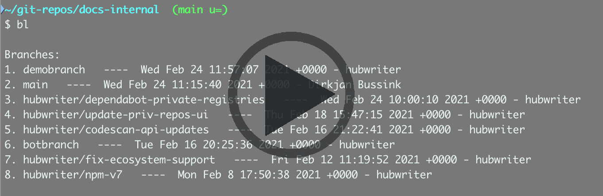

# branchlister
A quick way to change Git branches

## Is this for you?
✅ You use Git on the command line<br>
✅ You find yourself switching branches frequently<br>
✅ You'd like a quick, easy way to switch branches - the fewer key presses the better

## How to use branchlister

<a href="https://youtu.be/_qClOhrrkB0"></a>

On the command line, in a Git location, enter `bl`.
You get a list of 8 branches for the current repository, in order of the most recent commit to the branch, 
with the most recently updated branch at the top of the list.

```
% bl

Branches:
1.  expand-all   ----  Wed Apr 4 15:14:50 2018 +0100 - alistair
2.  main   ----  Tue Apr 3 17:18:57 2018 +0100 - John Doe
3.  fix-anchors-in-edge   ----  Tue Apr 3 14:56:05 2018 +0100 - alistair
4.  user-css   ----  Tue Apr 3 14:00:17 2018 +0100 - alistair
5.  space-tidyup   ----  Tue Apr 3 12:55:00 2018 +0100 - alistair
6.  fix-anchor-jump   ----  Wed Mar 28 15:06:35 2018 +0100 - alistair
7.  index-dontsearch   ----  Wed Mar 28 13:49:00 2018 +0100 - alistair
8.  nonsearch-topic   ----  Wed Mar 28 13:06:47 2018 +0100 - alistair
```

To switch to a branch just enter: `bb` followed by the number shown.

So, in the above example, if I want to check out the branch called `fix-anchors-in-edge`, 
I enter `bb3`.

This saves me typing `git checkout fix-anchors-in-edge`.

To check out the first branch in the list you can just enter `bb` (although `bb1` also works).

If you want to list more than 8 branches, give the number of branches after `bl`. 
For example, to list the 20 most recently updated branches, enter: `bl 20` (note the space before the number). 
To switch to a branch listed higher than 8 use a space between `bb` and the number - e.g. `bb 15`.

### Mnemonics

Think:
* `bl` = branch list
* `bb` = branches

### How does it work

It requires you to set up 10 aliases to specific commands.

`bl` runs a bash script called `branchlister.sh`. 
`bb` and `bb1`&ndash;`bb8` run a bash script called `branchpicker.sh`.

### Set up

#### 1. Download the bash scripts

Download the latest release from https://github.com/hubwriter/branchlister/releases/, unzip the download, 
and save `branchlister.sh` and `branchpicker.sh` to a suitable location (for example, `/home/<username>/bash-scripts/`).

#### 2. Create the aliases

Add the following 8 aliases. The files you have to edit to create these aliases will depend on the shell you are using 
(e.g. `.bashrc` or `.bash_profile` for bash).

IMPORTANT: The paths to the scripts must match the location in which you saved the scripts.

**Windows**
Add these aliases (e.g. for bash add these to `/c/Users/<username>/.bashrc`):
```
alias bl='bash /c/programming/bash-scripts/branchlister.sh'
alias bb='bash /c/some-path/bash-scripts/branchpicker.sh'
alias bb1='bash /c/some-path/bash-scripts/branchpicker.sh 1'
alias bb2='bash /c/some-path/bash-scripts/branchpicker.sh 2'
alias bb3='bash /c/some-path/bash-scripts/branchpicker.sh 3'
alias bb4='bash /c/some-path/bash-scripts/branchpicker.sh 4'
alias bb5='bash /c/some-path/bash-scripts/branchpicker.sh 5'
alias bb6='bash /c/some-path/bash-scripts/branchpicker.sh 6'
alias bb7='bash /c/some-path/bash-scripts/branchpicker.sh 7'
alias bb8='bash /c/some-path/bash-scripts/branchpicker.sh 8'
```

**Linux**
Add these aliases (e.g. for bash add these to `~/.bash_profile`):
```
alias bl='bash /home/<username>/bash-scripts/branchlister.sh'
alias bb='bash /home/<username>/bash-scripts/branchpicker.sh'
alias bb1='bash /home/<username>/bash-scripts/branchpicker.sh 1'
alias bb2='bash /home/<username>/bash-scripts/branchpicker.sh 2'
alias bb3='bash /home/<username>/bash-scripts/branchpicker.sh 3'
alias bb4='bash /home/<username>/bash-scripts/branchpicker.sh 4'
alias bb5='bash /home/<username>/bash-scripts/branchpicker.sh 5'
alias bb6='bash /home/<username>/bash-scripts/branchpicker.sh 6'
alias bb7='bash /home/<username>/bash-scripts/branchpicker.sh 7'
alias bb8='bash /home/<username>/bash-scripts/branchpicker.sh 8'
```

#### 3. Restart the shell

Force the shell to apply the updated configuration, by restarting the shell and logging in again. 
Alternatively, tell the shell to re-read its configuration - (e.g. for bash configurations in `.bash_profile` enter `source ~/.bash_profile`).

<hr>

### Some details about the scripts

If you edit the scripts, don't put #comments at the end of lines, it breaks things.

`$IFS`, used in both scripts, is the field separator, so `oIFS="$IFS"` just captures the current field separator so that we can put it back again later.

`IFS=$'\n'`, used in both scripts, sets the field separator to a newline, which allows us to create an array of values from the Git output, by splitting it on the newline character.

In `branchpicker.sh`, the `git for-each-ref …` command gives you a list of branches:
```
git for-each-ref --count=8 --sort=-committerdate refs/heads/
b630797516a83a801fd5e40c7966e80aba1e9d75 commit	refs/heads/main
3fc47b625c8b75155bad96cd4f9a991f93701408 commit	refs/heads/local-test-docker
7bb84ca6bfdfb50b3566bcc2fd76fe8ccb6e3ed1 commit	refs/heads/rc/1.19
33592a05d5cfdb91952f376f798b02178f32a826 commit	refs/heads/rc/1.18
bd2fd1c3ff22bdb3ef4ab2a175e4cd1e12bf58dd commit	refs/heads/newtest
bd2fd1c3ff22bdb3ef4ab2a175e4cd1e12bf58dd commit	refs/heads/rc/1.16
```  
This can be formatted - e.g. here is just the branch names:
```
git for-each-ref --count=8 --sort=-committerdate refs/heads/ --format="%(refname)"
refs/heads/master
refs/heads/local-test-docker
refs/heads/rc/1.19
refs/heads/rc/1.18
refs/heads/newtest
refs/heads/rc/1.16
```
And here is the fully formatted list:
```
git for-each-ref --count=8 --sort=-committerdate refs/heads/ --format="%(refname)   ----  %(committerdate) - %(authorname)"
refs/heads/master   ----  Fri Jan 18 18:11:12 2019 +0000 - John Doe
refs/heads/local-test-docker   ----  Wed Jan 16 15:16:03 2019 +0000 - alistair
refs/heads/rc/1.19   ----  Thu Dec 13 17:46:22 2018 +0000 - Jenkins II
refs/heads/rc/1.18   ----  Thu Nov 15 15:30:48 2018 +0000 - Jenkins II
refs/heads/newtest   ----  Tue Mar 27 18:10:03 2018 +0100 - alistair
refs/heads/rc/1.16   ----  Tue Mar 27 18:10:03 2018 +0100 - Jenkins II
```

In `branchpicker.sh`, the line:
```
((item_requested--))
```
just decrements the number you chose (e.g. 3 if you entered `bb3`) by 1 because arrays start at 0 
so, if you want to switch to the first branch in the list, you need to checkout `${brancharray[0]`.
